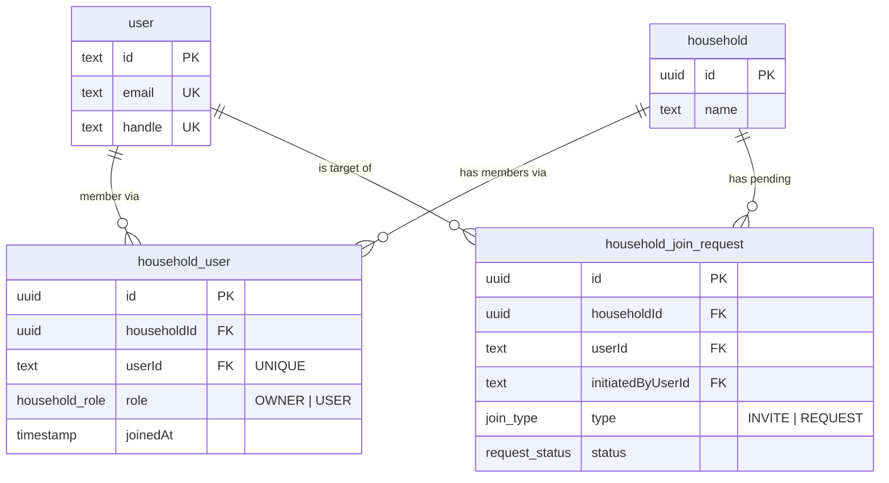
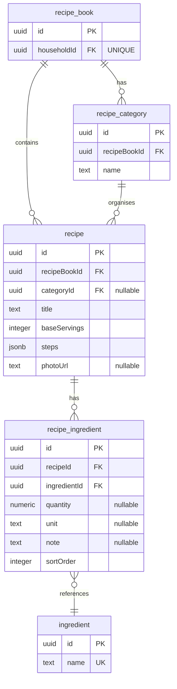
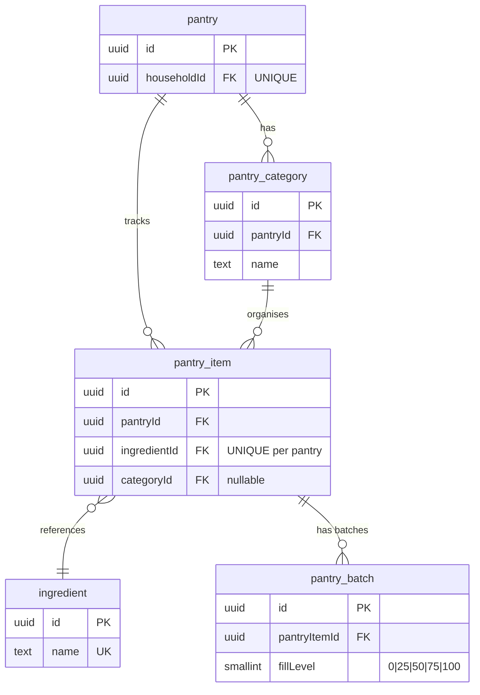
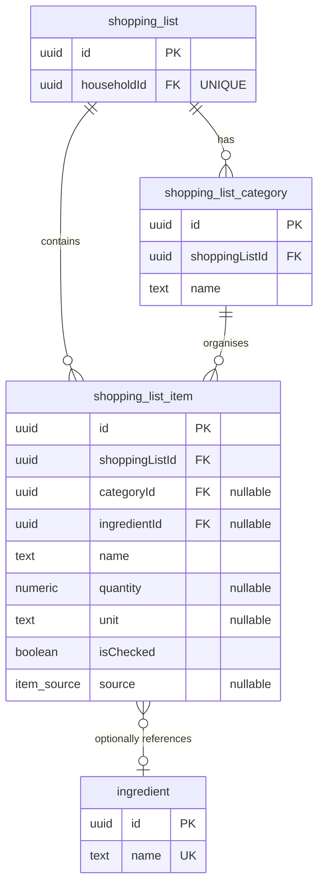
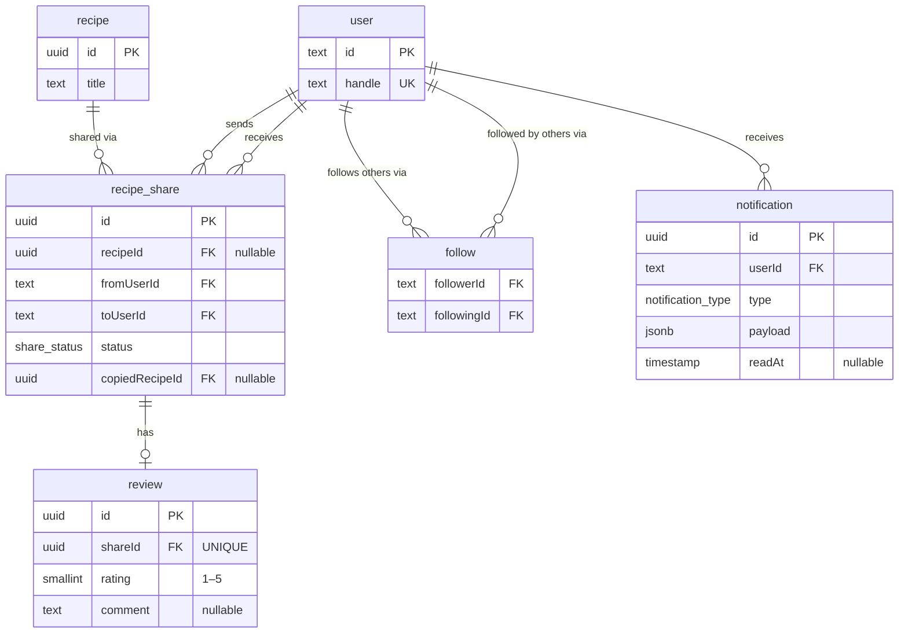

# Recipe Book App — Backend

Node.js · Express · TypeScript · Drizzle ORM · Neon (PostgreSQL) · better-auth

> **This is a living document.** Updated as the build progresses — architecture, API routes, schema changes, and design decisions are recorded here.

---

## Table of Contents

1. [ERD — Full Schema](#1-erd--full-schema)
2. [Domain Diagrams](#2-domain-diagrams)
3. [Table Reference](#3-table-reference)
4. [Enums](#4-enums)
5. [Key Invariants & Design Decisions](#5-key-invariants--design-decisions)
6. [Architecture](#6-architecture)
7. [Setup](#7-setup)
8. [API Routes](#8-api-routes)

---

## 1. ERD — Full Schema

```mermaid
erDiagram

  %% ── AUTH (generated by better-auth CLI) ──────────────────────────
  user {
    text id PK
    text name
    text email UK
    boolean emailVerified
    text image "nullable"
    text handle UK "nullable"
    timestamp createdAt
    timestamp updatedAt
  }
  session {
    text id PK
    text userId FK
    text token UK
    timestamp expiresAt
    text ipAddress "nullable"
    text userAgent "nullable"
    timestamp createdAt
    timestamp updatedAt
  }
  account {
    text id PK
    text userId FK
    text accountId
    text providerId
    text accessToken "nullable"
    text refreshToken "nullable"
    text idToken "nullable"
    text password "nullable"
    timestamp createdAt
    timestamp updatedAt
  }
  verification {
    text id PK
    text identifier
    text value
    timestamp expiresAt
    timestamp createdAt
    timestamp updatedAt
  }

  %% ── HOUSEHOLD & MEMBERSHIP ────────────────────────────────────────
  household {
    uuid id PK
    text name
    timestamp createdAt
    timestamp updatedAt
  }
  household_user {
    uuid id PK
    uuid householdId FK
    text userId FK "UNIQUE"
    household_role role "OWNER | USER"
    timestamp joinedAt
  }
  household_join_request {
    uuid id PK
    uuid householdId FK
    text userId FK
    text initiatedByUserId FK
    join_type type "INVITE | REQUEST"
    request_status status "PENDING | ACCEPTED | DECLINED | CANCELLED"
    timestamp createdAt
    timestamp updatedAt
  }

  %% ── CANONICAL INGREDIENT ──────────────────────────────────────────
  ingredient {
    uuid id PK
    text name UK "normalised lowercase"
    timestamp createdAt
  }

  %% ── RECIPE BOOK ───────────────────────────────────────────────────
  recipe_book {
    uuid id PK
    uuid householdId FK "UNIQUE"
    timestamp createdAt
  }
  recipe_category {
    uuid id PK
    uuid recipeBookId FK
    text name "UNIQUE per book"
    timestamp createdAt
  }
  recipe {
    uuid id PK
    uuid recipeBookId FK
    uuid categoryId FK "nullable"
    text title
    text description "nullable"
    integer baseServings
    jsonb steps
    text photoUrl "nullable"
    text sharedByUserId FK "nullable"
    uuid originalRecipeId FK "nullable – self-ref"
    timestamp createdAt
    timestamp updatedAt
  }
  recipe_ingredient {
    uuid id PK
    uuid recipeId FK
    uuid ingredientId FK
    numeric quantity "nullable"
    text unit "nullable"
    text note "nullable"
    integer sortOrder
  }

  %% ── PANTRY ────────────────────────────────────────────────────────
  pantry {
    uuid id PK
    uuid householdId FK "UNIQUE"
    timestamp createdAt
  }
  pantry_category {
    uuid id PK
    uuid pantryId FK
    text name "UNIQUE per pantry"
    timestamp createdAt
  }
  pantry_item {
    uuid id PK
    uuid pantryId FK
    uuid ingredientId FK "UNIQUE per pantry"
    uuid categoryId FK "nullable"
    timestamp createdAt
    timestamp updatedAt
  }
  pantry_batch {
    uuid id PK
    uuid pantryItemId FK
    smallint fillLevel "0 | 25 | 50 | 75 | 100"
    timestamp createdAt
    timestamp updatedAt
  }

  %% ── SHOPPING LIST ─────────────────────────────────────────────────
  shopping_list {
    uuid id PK
    uuid householdId FK "UNIQUE"
    timestamp createdAt
  }
  shopping_list_category {
    uuid id PK
    uuid shoppingListId FK
    text name "UNIQUE per list"
    timestamp createdAt
  }
  shopping_list_item {
    uuid id PK
    uuid shoppingListId FK
    uuid categoryId FK "nullable"
    uuid ingredientId FK "nullable"
    text name
    numeric quantity "nullable"
    text unit "nullable"
    boolean isChecked
    item_source source "nullable – RECIPE | PANTRY | DIRECT"
    timestamp createdAt
    timestamp updatedAt
  }

  %% ── SHARING, REVIEWS, FOLLOWS, NOTIFICATIONS ──────────────────────
  recipe_share {
    uuid id PK
    uuid recipeId FK "nullable"
    text fromUserId FK
    text toUserId FK
    share_status status "PENDING | ACCEPTED | REJECTED"
    uuid copiedRecipeId FK "nullable"
    timestamp createdAt
    timestamp updatedAt
  }
  review {
    uuid id PK
    uuid shareId FK "UNIQUE"
    smallint rating "1–5"
    text comment "nullable"
    timestamp createdAt
    timestamp updatedAt
  }
  follow {
    text followerId FK
    text followingId FK
    timestamp createdAt
  }
  notification {
    uuid id PK
    text userId FK
    notification_type type
    jsonb payload
    timestamp readAt "nullable"
    timestamp createdAt
  }

  %% ── RELATIONSHIPS ─────────────────────────────────────────────────
  user ||--o{ session : "has"
  user ||--o{ account : "has"
  user ||--o{ household_user : "member via"
  household ||--o{ household_user : "has members via"
  household ||--|| recipe_book : "owns"
  household ||--|| pantry : "owns"
  household ||--|| shopping_list : "owns"
  household ||--o{ household_join_request : "receives"
  user ||--o{ household_join_request : "is target of"
  user ||--o{ household_join_request : "initiates"

  recipe_book ||--o{ recipe_category : "has"
  recipe_book ||--o{ recipe : "contains"
  recipe_category ||--o{ recipe : "organises"
  recipe ||--o{ recipe_ingredient : "has"
  recipe_ingredient }o--|| ingredient : "references"

  pantry ||--o{ pantry_category : "has"
  pantry ||--o{ pantry_item : "tracks"
  pantry_category ||--o{ pantry_item : "organises"
  pantry_item }o--|| ingredient : "references"
  pantry_item ||--o{ pantry_batch : "has batches"

  shopping_list ||--o{ shopping_list_category : "has"
  shopping_list ||--o{ shopping_list_item : "contains"
  shopping_list_category ||--o{ shopping_list_item : "organises"
  shopping_list_item }o--o| ingredient : "optionally references"

  user ||--o{ recipe_share : "sends"
  user ||--o{ recipe_share : "receives"
  recipe ||--o{ recipe_share : "shared via"
  recipe_share ||--o| review : "has"

  user ||--o{ follow : "follows"
  user ||--o{ follow : "followed by"

  user ||--o{ notification : "receives"

  recipe ||--o| recipe : "copied from (self-ref)"
```



---

## 2. Domain Diagrams

### Household & Membership



### Recipe Book



### Pantry



### Shopping List



### Sharing, Reviews & Social



---

## 3. Table Reference

### Auth tables — generated by better-auth CLI

| Table | Purpose |
|---|---|
| `user` | Core identity. `handle` is added via `additionalFields` for the public directory. |
| `session` | Active login sessions. |
| `account` | Provider links — `password` column holds bcrypt hash for email/password logins; Google OAuth rows have `providerId = 'google'`. |
| `verification` | Email verification and magic-link tokens. |

---

### `household`

| Column | Type | Constraints |
|---|---|---|
| `id` | uuid | PK |
| `name` | text | NOT NULL |
| `createdAt` | timestamp | |
| `updatedAt` | timestamp | |

---

### `household_user`

| Column | Type | Constraints |
|---|---|---|
| `id` | uuid | PK |
| `householdId` | uuid | FK → household (CASCADE) |
| `userId` | text | FK → user; UNIQUE |
| `role` | enum | `OWNER \| USER` |
| `joinedAt` | timestamp | |

Partial unique index: `UNIQUE (householdId) WHERE role = 'OWNER'` — enforces exactly one owner per household.

---

### `household_join_request`

| Column | Type | Constraints |
|---|---|---|
| `id` | uuid | PK |
| `householdId` | uuid | FK → household (CASCADE) |
| `userId` | text | FK → user (target) |
| `initiatedByUserId` | text | FK → user |
| `type` | enum | `INVITE \| REQUEST` |
| `status` | enum | `PENDING \| ACCEPTED \| DECLINED \| CANCELLED` |
| `createdAt` | timestamp | |
| `updatedAt` | timestamp | |

---

### `ingredient`

Global — not scoped to any household. Normalised to lowercase before insert.

| Column | Type | Constraints |
|---|---|---|
| `id` | uuid | PK |
| `name` | text | UNIQUE |
| `createdAt` | timestamp | |

---

### `recipe_book`

| Column | Type | Constraints |
|---|---|---|
| `id` | uuid | PK |
| `householdId` | uuid | FK → household (CASCADE); UNIQUE |
| `createdAt` | timestamp | |

---

### `recipe_category`

| Column | Type | Constraints |
|---|---|---|
| `id` | uuid | PK |
| `recipeBookId` | uuid | FK → recipe_book (CASCADE) |
| `name` | text | UNIQUE(recipeBookId, name) |
| `createdAt` | timestamp | |

---

### `recipe`

| Column | Type | Constraints |
|---|---|---|
| `id` | uuid | PK |
| `recipeBookId` | uuid | FK → recipe_book (CASCADE) |
| `categoryId` | uuid | FK → recipe_category; nullable (SET NULL) |
| `title` | text | NOT NULL |
| `description` | text | nullable |
| `baseServings` | integer | NOT NULL |
| `steps` | jsonb | Ordered array of step strings |
| `photoUrl` | text | nullable |
| `sharedByUserId` | text | FK → user; nullable |
| `originalRecipeId` | uuid | FK → recipe (self-ref); nullable |
| `createdAt` | timestamp | |
| `updatedAt` | timestamp | |

---

### `recipe_ingredient`

| Column | Type | Constraints |
|---|---|---|
| `id` | uuid | PK |
| `recipeId` | uuid | FK → recipe (CASCADE) |
| `ingredientId` | uuid | FK → ingredient |
| `quantity` | numeric | nullable — null = non-scalable ingredient |
| `unit` | text | nullable |
| `note` | text | nullable |
| `sortOrder` | integer | NOT NULL |

---

### `pantry`

| Column | Type | Constraints |
|---|---|---|
| `id` | uuid | PK |
| `householdId` | uuid | FK → household (CASCADE); UNIQUE |
| `createdAt` | timestamp | |

---

### `pantry_category`

| Column | Type | Constraints |
|---|---|---|
| `id` | uuid | PK |
| `pantryId` | uuid | FK → pantry (CASCADE) |
| `name` | text | UNIQUE(pantryId, name) |
| `createdAt` | timestamp | |

---

### `pantry_item`

| Column | Type | Constraints |
|---|---|---|
| `id` | uuid | PK |
| `pantryId` | uuid | FK → pantry (CASCADE) |
| `ingredientId` | uuid | FK → ingredient; UNIQUE(pantryId, ingredientId) |
| `categoryId` | uuid | FK → pantry_category; nullable (SET NULL) |
| `createdAt` | timestamp | |
| `updatedAt` | timestamp | |

---

### `pantry_batch`

Effective stock per item = `SUM(fillLevel)` across all its batches.

| Column | Type | Constraints |
|---|---|---|
| `id` | uuid | PK |
| `pantryItemId` | uuid | FK → pantry_item (CASCADE) |
| `fillLevel` | smallint | CHECK IN (0, 25, 50, 75, 100) |
| `createdAt` | timestamp | |
| `updatedAt` | timestamp | |

---

### `shopping_list`

| Column | Type | Constraints |
|---|---|---|
| `id` | uuid | PK |
| `householdId` | uuid | FK → household (CASCADE); UNIQUE |
| `createdAt` | timestamp | |

---

### `shopping_list_category`

| Column | Type | Constraints |
|---|---|---|
| `id` | uuid | PK |
| `shoppingListId` | uuid | FK → shopping_list (CASCADE) |
| `name` | text | UNIQUE(shoppingListId, name) |
| `createdAt` | timestamp | |

---

### `shopping_list_item`

| Column | Type | Constraints |
|---|---|---|
| `id` | uuid | PK |
| `shoppingListId` | uuid | FK → shopping_list (CASCADE) |
| `categoryId` | uuid | FK → shopping_list_category; nullable (SET NULL) |
| `ingredientId` | uuid | FK → ingredient; nullable |
| `name` | text | NOT NULL |
| `quantity` | numeric | nullable |
| `unit` | text | nullable |
| `isChecked` | boolean | NOT NULL, default false |
| `source` | enum | nullable — `RECIPE \| PANTRY \| DIRECT` |
| `createdAt` | timestamp | |
| `updatedAt` | timestamp | |

---

### `recipe_share`

Both recipe FKs use SET NULL so share history survives deletion of the original or the copy.

| Column | Type | Constraints |
|---|---|---|
| `id` | uuid | PK |
| `recipeId` | uuid | FK → recipe; nullable (SET NULL) |
| `fromUserId` | text | FK → user |
| `toUserId` | text | FK → user |
| `status` | enum | `PENDING \| ACCEPTED \| REJECTED` |
| `copiedRecipeId` | uuid | FK → recipe; nullable (SET NULL) |
| `createdAt` | timestamp | |
| `updatedAt` | timestamp | |

---

### `review`

Anchored to the share, not the recipe directly. Aggregate rating = `AVG(rating)` across all reviews for shares of a given original recipe.

| Column | Type | Constraints |
|---|---|---|
| `id` | uuid | PK |
| `shareId` | uuid | FK → recipe_share (CASCADE); UNIQUE |
| `rating` | smallint | CHECK 1–5 |
| `comment` | text | nullable |
| `createdAt` | timestamp | |
| `updatedAt` | timestamp | |

---

### `follow`

| Column | Type | Constraints |
|---|---|---|
| `followerId` | text | FK → user; composite PK |
| `followingId` | text | FK → user; composite PK |
| `createdAt` | timestamp | |

Constraint: `CHECK (followerId <> followingId)`

---

### `notification`

| Column | Type | Constraints |
|---|---|---|
| `id` | uuid | PK |
| `userId` | text | FK → user (CASCADE) |
| `type` | enum | `RECIPE_SHARED \| HOUSEHOLD_INVITE \| JOIN_REQUEST` |
| `payload` | jsonb | Per-type data |
| `readAt` | timestamp | nullable — null = unread |
| `createdAt` | timestamp | |

---

## 4. Enums

| Enum | Values |
|---|---|
| `household_role` | `OWNER`, `USER` |
| `join_type` | `INVITE`, `REQUEST` |
| `request_status` | `PENDING`, `ACCEPTED`, `DECLINED`, `CANCELLED` |
| `share_status` | `PENDING`, `ACCEPTED`, `REJECTED` |
| `item_source` | `RECIPE`, `PANTRY`, `DIRECT` |
| `notification_type` | `RECIPE_SHARED`, `HOUSEHOLD_INVITE`, `JOIN_REQUEST` |

---

## 5. Key Invariants & Design Decisions

### Invariants

| Rule | Enforcement |
|---|---|
| One household per user | `UNIQUE(household_user.userId)` |
| Exactly one owner per household | Partial unique index `WHERE role = 'OWNER'`; ownership transfer is a single atomic transaction |
| One recipe_book per household | `UNIQUE(recipe_book.householdId)` |
| One pantry per household | `UNIQUE(pantry.householdId)` |
| One shopping_list per household | `UNIQUE(shopping_list.householdId)` |
| One pantry_item per ingredient per pantry | `UNIQUE(pantry_item.pantryId, pantry_item.ingredientId)` |
| One review per share | `UNIQUE(review.shareId)` |
| Cannot follow yourself | `CHECK(follow.followerId <> follow.followingId)` |
| Last user leaves → cascade delete | `ON DELETE CASCADE` on household tears down book, pantry, list, and all descendants |
| Authorization is a single question | Every resource has a path to `household_id`; one middleware check: "is this user a member of that household?" |

### Design decisions

**Global ingredient table** — The `ingredient` table is not scoped to any household. It is the shared reference that connects recipe ingredients, pantry items, and shopping list items so they resolve to the same entity. This is the deliberate exception to the household-scoping rule and is what powers pantry-status indicators, "What can I make?" matching, and list aggregation.

**JSONB for recipe steps** — Steps are always read and written as a unit, so a normalised `recipe_step` table adds joins with no benefit at MVP.

**User-created pantry categories** — `pantry_category` is user-defined for consistency with `recipe_category` and `shopping_list_category`.

**Owner as a role on `household_user`** — Ownership is the row where `role = 'OWNER'`. Transfer is a single atomic `UPDATE`. No `ownerId` column on `household`.

**`handle` as an `additionalField` on `user`** — Added via better-auth configuration, not a separate profile table. Keeps identity in one place.

**Share history is permanent** — `recipe_share.recipeId` uses SET NULL so the share record outlives the original recipe. Recipients retain their history and reviews regardless of what the author does.

---

## 6. Architecture

### Middleware order

```
helmet → cors → rate limit → better-auth handler → express.json() → routes
```

- **cors** must precede the auth handler so browser preflight (OPTIONS) requests are resolved before any credentialed request.
- **better-auth handler** must be mounted before `express.json()` — a documented requirement; requests hang otherwise.

### Authorization model

Every app resource carries a path back to `household_id`. The auth check is always: "is the requesting user a member of the household that owns this resource?" Implemented as a single reusable middleware.

---

## 7. Setup

*Filled in once project scaffolding is complete.*

---

## 8. API Routes

*Filled in as routes are built.*
