# Recipe Book — Backend

Node.js · Express · TypeScript · Drizzle ORM · Neon · better-auth

---

## Purpose

REST API for a household recipe management app. Handles authentication, household membership, recipe storage, pantry tracking, shopping lists, recipe sharing, cook sessions, and automated recipe extraction from images and URLs.

---

## Tech Stack

| Library | Why |
|---|---|
| **Node.js + Express** | Lightweight, well-understood request/response model. Express gives full control over middleware ordering — important for the auth and CORS sequencing this app requires. |
| **TypeScript** | End-to-end type safety; shared Zod schemas with the frontend eliminate duplicated validation logic. |
| **Drizzle ORM** | Schema-as-TypeScript with first-class migrations. Queries stay close to SQL; `drizzle-zod` generates Zod schemas from table definitions automatically. |
| **Neon (PostgreSQL)** | Serverless PostgreSQL with instant branch-per-test-environment support. Scales to zero between dev sessions. |
| **better-auth** | Handles email/password + Google OAuth, sessions, email verification, and password reset out of the box. Auth tables are CLI-generated; the app only adds fields via `additionalFields`. |
| **Resend** | Transactional email (verification, password reset) with reliable delivery and a simple API. |
| **Cloudinary** | Hosted image CDN. Only URLs are stored in the database — no binary data in Postgres. |
| **multer** | Multipart file handling for image uploads. Memory storage for scan images (never persisted); stream-to-Cloudinary for recipe and pantry photos. |

---

## Features

### Households
Every user belongs to exactly one household. A household owns one recipe book, one pantry, and one shopping list — shared by all its members. Households have a single owner; ownership can be transferred atomically. Membership flows via invite or join-request, both of which generate in-app notifications. When the last member leaves, the household and all its data are deleted.

### Recipe Book
Full CRUD on recipes organised into user-created categories. Each recipe stores a title, description, base serving count, ordered steps, and a structured ingredients list. Ingredients reference a canonical global ingredient table — the entity that connects recipes to pantry stock and shopping list entries. Recipes can be added manually, extracted from uploaded images, or imported from a URL.

### Serving Scaling & Measurement Conversion
Recipes are stored at a base serving count. Displayed quantities scale proportionally; measurements convert between metric and imperial on request. Both are display-only — stored values never change.

### Pantry
Tracks household stock organised by category. Each pantry item can have multiple batches, each with a fill level (0 / 25 / 50 / 75 / 100%). Effective stock is the sum of all batch fill levels for that item. Items can be pushed to the shopping list.

### "What Can I Make?"
Matches every recipe in the household's book against current pantry stock and returns three tiers: ready to cook (all measurable ingredients in stock), almost there (1–2 missing, with a one-tap shopping list action), and the rest ranked by match percentage.

### Shopping List
A household-shared list. Items can originate from recipe ingredients, pantry items, or direct free-text entry. Organised into user-created categories.

### Cook Sessions
An explicit start → complete flow. Pantry changes are queued in a `pendingChanges` JSONB column as the user ticks ingredients — nothing is written to the pantry until the session is confirmed. Confirmation applies all queued updates in a single atomic transaction. Sessions are persisted from the moment cooking starts, so the user can resume across devices.

### Sharing & Reviews
A user can share any recipe in their household's book with any other user. The recipient accepts or rejects; on accept, an independent copy is created in the recipient's household's book. Share history is permanent — it outlives both the original and the copy via `SET NULL` foreign keys. Recipients can leave one review per share (1–5 stars + optional comment), which surfaces on the original recipe as an aggregate rating.

### Social
Users have public profiles with searchable handles. Following another user is a contact-list feature that populates the share dialog's quick-pick list. An in-app notification inbox covers recipe shares, household invites, and join requests.

### Recipe Extraction
Images (up to 10 per scan) and recipe page URLs are processed to extract structured recipe data — title, description, base servings, steps, and ingredients with quantities and units — which pre-fills the recipe form for user review before saving. Scan images are ephemeral and never stored.

---

## Data Model

```mermaid
erDiagram

  user {
    text id PK
    text name
    text email UK
    text handle UK "nullable"
    text image "nullable"
    text bio "nullable"
    text theme "nullable"
  }
  household {
    uuid id PK
    text name
  }
  household_user {
    uuid id PK
    uuid householdId FK
    text userId FK "UNIQUE"
    household_role role "OWNER | USER"
    timestamp joinedAt
  }
  household_join_request {
    uuid id PK
    uuid householdId FK
    text userId FK
    text initiatedByUserId FK
    join_type type "INVITE | REQUEST"
    request_status status "PENDING | ACCEPTED | DECLINED | CANCELLED"
  }
  ingredient {
    uuid id PK
    text name UK "normalised lowercase — global, not household-scoped"
  }
  recipe_book {
    uuid id PK
    uuid householdId FK "UNIQUE"
  }
  recipe_category {
    uuid id PK
    uuid recipeBookId FK
    text name
  }
  recipe {
    uuid id PK
    uuid recipeBookId FK
    uuid categoryId FK "nullable"
    text title
    text description "nullable"
    integer baseServings
    jsonb steps
    text sharedByUserId "nullable"
    uuid originalRecipeId "nullable — self-ref"
  }
  recipe_ingredient {
    uuid id PK
    uuid recipeId FK
    uuid ingredientId FK
    numeric quantity "nullable"
    text unit "nullable"
    text note "nullable"
    integer sortOrder
  }
  recipe_image {
    uuid id PK
    uuid recipeId FK
    text url
    integer sortOrder
  }
  pantry {
    uuid id PK
    uuid householdId FK "UNIQUE"
  }
  pantry_category {
    uuid id PK
    uuid pantryId FK
    text name
  }
  pantry_item {
    uuid id PK
    uuid pantryId FK
    uuid ingredientId FK "UNIQUE per pantry"
    uuid categoryId FK "nullable"
  }
  pantry_batch {
    uuid id PK
    uuid pantryItemId FK
    smallint fillLevel "0 | 25 | 50 | 75 | 100"
  }
  pantry_item_image {
    uuid id PK
    uuid pantryItemId FK
    text url
    integer sortOrder
  }
  shopping_list {
    uuid id PK
    uuid householdId FK "UNIQUE"
  }
  shopping_list_category {
    uuid id PK
    uuid shoppingListId FK
    text name
  }
  shopping_list_item {
    uuid id PK
    uuid shoppingListId FK
    uuid categoryId FK "nullable"
    uuid ingredientId FK "nullable"
    text name
    numeric quantity "nullable"
    text unit "nullable"
    boolean isChecked
    item_source source "nullable — RECIPE | PANTRY | DIRECT"
  }
  recipe_share {
    uuid id PK
    uuid recipeId FK "nullable — SET NULL on delete"
    text fromUserId FK
    text toUserId FK
    share_status status "PENDING | ACCEPTED | REJECTED"
    uuid copiedRecipeId FK "nullable — SET NULL on delete"
  }
  review {
    uuid id PK
    uuid shareId FK "UNIQUE"
    smallint rating "1–5"
    text comment "nullable"
  }
  follow {
    text followerId FK
    text followingId FK
  }
  notification {
    uuid id PK
    text userId FK
    notification_type type
    jsonb payload
    timestamp readAt "nullable"
  }
  recipe_cook {
    uuid id PK
    text userId FK
    uuid recipeId FK "nullable — SET NULL on delete"
    cook_status status "IN_PROGRESS | COMPLETED | CANCELLED"
    jsonb pendingChanges "nullable"
    text note "nullable"
    timestamp cookedAt
  }
  recipe_cook_image {
    uuid id PK
    uuid recipeCookId FK
    text url
    integer sortOrder
  }
  user_pinned_recipe {
    text userId FK
    uuid recipeId FK "nullable — SET NULL on delete"
    integer position "1–5"
  }

  user ||--o{ household_user : "member via"
  household ||--o{ household_user : "has members via"
  household ||--|| recipe_book : "owns"
  household ||--|| pantry : "owns"
  household ||--|| shopping_list : "owns"
  household ||--o{ household_join_request : "receives"
  user ||--o{ household_join_request : "is target of / initiates"

  recipe_book ||--o{ recipe_category : "has"
  recipe_book ||--o{ recipe : "contains"
  recipe_category ||--o{ recipe : "organises"
  recipe ||--o{ recipe_ingredient : "has"
  recipe_ingredient }o--|| ingredient : "references"
  recipe ||--o{ recipe_image : "has"
  recipe ||--o| recipe : "copied from (self-ref)"

  pantry ||--o{ pantry_category : "has"
  pantry ||--o{ pantry_item : "tracks"
  pantry_category ||--o{ pantry_item : "organises"
  pantry_item }o--|| ingredient : "references"
  pantry_item ||--o{ pantry_batch : "has batches"
  pantry_item ||--o{ pantry_item_image : "has"

  shopping_list ||--o{ shopping_list_category : "has"
  shopping_list ||--o{ shopping_list_item : "contains"
  shopping_list_category ||--o{ shopping_list_item : "organises"
  shopping_list_item }o--o| ingredient : "optionally references"

  user ||--o{ recipe_share : "sends"
  user ||--o{ recipe_share : "receives"
  recipe ||--o{ recipe_share : "shared via"
  recipe_share ||--o| review : "has"
  user ||--o{ follow : "follows"
  user ||--o{ notification : "receives"
  user ||--o{ recipe_cook : "has"
  user ||--o{ user_pinned_recipe : "pins"
  recipe ||--o{ recipe_cook : "cooked via"
  recipe_cook ||--o{ recipe_cook_image : "has"
```

---

## Key Design Principles

**Global ingredient table** — `ingredient` is not scoped to any household. It is the shared canonical reference that lets recipe ingredients, pantry items, and shopping list entries all resolve to the same entity. This is what powers pantry-status indicators on recipe ingredients, "What can I make?" matching, and list aggregation.

**Household as the authorisation boundary** — every resource has a path back to `household_id`. Authentication is always one middleware question: "is this user a member of the household that owns this resource?"

**Exactly one owner per household** — enforced by a partial unique index (`UNIQUE WHERE role = 'OWNER'`). Ownership transfer is an atomic swap. There is no `ownerId` column on `household` — ownership is a role on the membership row.

**Cook sessions defer pantry writes** — pending changes accumulate in a `pendingChanges` JSONB column throughout a cook session and are only applied to the pantry in a single atomic transaction when the session is confirmed. Cancelling discards local state with no database cleanup needed.

**Sharing is copy-on-accept** — accepting a share creates an independent copy of the recipe in the recipient's household. Share history and reviews survive deletion of both the original and the copy via `SET NULL` foreign keys.

**Middleware order** — `helmet → cors → rate limit → better-auth handler → express.json() → routes`. CORS must precede the auth handler so browser preflight requests resolve before any credentialed request. The auth handler must precede `express.json()` — a documented requirement of better-auth.

