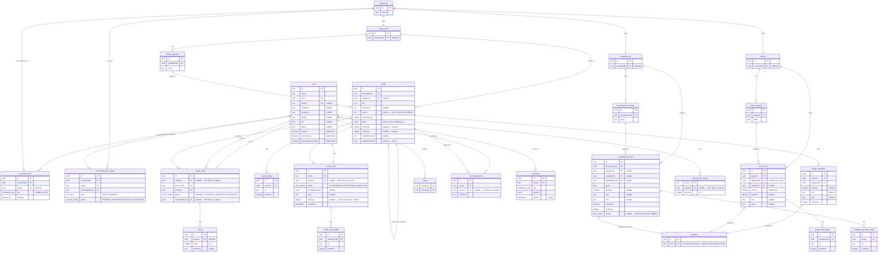

# The Shared Pantry Experience — Backend

Node.js · Express · TypeScript · Drizzle ORM · Neon · better-auth

---

## Purpose

REST API for a household recipe management app. Handles authentication, household membership, recipe storage, pantry tracking, shopping lists, recipe sharing, cook sessions, community posts, and automated recipe extraction from images and URLs.

---

## Tech Stack

| Library | Why |
|---|---|
| **Node.js + Express** | Lightweight, well-understood request/response model. Express gives full control over middleware ordering — important for the auth and CORS sequencing this app requires. |
| **TypeScript** | End-to-end type safety; shared Zod schemas with the frontend eliminate duplicated validation logic. |
| **Drizzle ORM** | Schema-as-TypeScript with first-class migrations. Queries stay close to SQL; `drizzle-zod` generates Zod schemas from table definitions automatically. |
| **Neon (PostgreSQL)** | Serverless PostgreSQL with instant branch-per-test-environment support. Scales to zero between dev sessions. |
| **better-auth** | Handles email/password + Google OAuth, sessions, email verification, and password reset out of the box. Auth tables are CLI-generated; the app only adds fields via `additionalFields`. |
| **Resend** | Transactional email (verification, password reset, email-change confirmation) with reliable delivery and a simple API. |
| **Cloudinary** | Hosted image CDN. Only URLs are stored in the database — no binary data in Postgres. |
| **multer** | Multipart file handling for image uploads. Memory storage for scan images (never persisted); stream-to-Cloudinary for recipe, pantry, and cook-session photos. |

---

## Features

### Households
Every user belongs to exactly one household. A household owns one recipe book, one pantry, and one shopping list — shared by all its members. Households have a single owner; ownership can be transferred atomically. Membership flows via invite or join-request, both of which generate in-app notifications. When the last member leaves, the household and all its data are deleted.

### Recipe Book
Full CRUD on recipes organised into user-created categories. Each recipe stores a title, description, source, base serving count, prep/cook times, ordered steps (with optional sub-steps per step), and a structured ingredients list. Ingredients reference a canonical global ingredient table — the entity that connects recipes to pantry stock and shopping list entries. Recipes can be added manually, extracted from uploaded images, or imported from a URL.

### Serving Scaling & Measurement Conversion
Recipes are stored at a base serving count. Displayed quantities scale proportionally; measurements convert between metric and imperial on request. Both are display-only — stored values never change.

### Pantry
Tracks household stock organised by category. Each pantry item records whether it is in stock, along with an optional quantity, unit, and notes field. Items can be pushed to the shopping list.

### "What Can I Make?"
Matches every recipe in the household's book against current pantry stock and returns three tiers: ready to cook (all measurable ingredients in stock), almost there (1–2 missing, with a one-tap shopping list action), and the rest ranked by match percentage.

### Shopping List
A household-shared list. Items can originate from recipe ingredients, pantry items, or direct free-text entry. Organised into user-created categories. Items carry a source flag (RECIPE / PANTRY / DIRECT), quantity, unit, note, and sort order.

### Cook Sessions
An explicit start → complete flow. Pantry changes are queued in a `pendingChanges` JSONB column as the user ticks ingredients — nothing is written to the pantry until the session is confirmed. Confirmation applies all queued updates in a single atomic transaction. Sessions are persisted from the moment cooking starts, so the user can resume across devices. A `servings` column records the serving size the user actually cooked at.

### Sharing & Reviews
A user can share any recipe in their household's book with any other user. The recipient accepts or rejects; on accept, an independent copy is created in the recipient's household's book. Share history is permanent — it outlives both the original and the copy via `SET NULL` foreign keys. Recipients can leave one review per share (1–5 stars + optional comment), which surfaces on the original recipe as an aggregate rating.

### Community Posts
Authenticated users can publish posts to a household-agnostic community feed. Each post links to a recipe (optional) and carries a text comment. The feed is visible to any logged-in user; posts from users with a private profile are hidden from others.

### Social
Users have public profiles with searchable handles. Following another user is a contact-list feature that populates the share dialog's quick-pick list. An in-app notification inbox covers recipe shares, household invites, and join requests.

### Recipe Extraction
Images (up to 10 per scan) and recipe page URLs are processed to extract structured recipe data — title, description, base servings, steps, and ingredients with quantities and units — which pre-fills the recipe form for user review before saving. Scan images are ephemeral and never stored.

### Tutorial / Onboarding Seed
`POST /api/tutorial/seed` populates a new user's household with demo recipes, pantry items, and shopping list entries so the app is immediately useful on first open. `POST /api/tutorial/complete` marks onboarding done.

---

## Data Model


```mermaid
erDiagram

  user {
    text id PK
    text name
    text email UK
    text handle UK "nullable"
    text firstName "nullable"
    text lastName "nullable"
    text image "nullable"
    text bio "nullable"
    text theme "nullable"
    boolean isPublic "default true"
    boolean isDemoUser "default false"
    boolean onboardingComplete "default false"
  }
  household {
    uuid id PK
    text name
  }
  household_user {
    uuid id PK
    uuid householdId FK
    text userId FK "UNIQUE"
    household_role role "OWNER | USER"
    timestamp joinedAt
  }
  household_join_request {
    uuid id PK
    uuid householdId FK
    text userId FK
    text initiatedByUserId FK
    join_type type "INVITE | REQUEST"
    request_status status "PENDING | ACCEPTED | DECLINED | CANCELLED"
  }
  ingredient {
    uuid id PK
    text name UK "normalised lowercase — global, not household-scoped"
  }
  recipe_book {
    uuid id PK
    uuid householdId FK "UNIQUE"
  }
  recipe_category {
    uuid id PK
    uuid recipeBookId FK
    text name
  }
  recipe {
    uuid id PK
    uuid recipeBookId FK
    uuid categoryId FK "nullable"
    text title
    text description "nullable"
    text source "nullable — URL or plain text attribution"
    integer baseServings
    jsonb steps "array of { text, subSteps[] }"
    integer prepTime "nullable — minutes"
    integer cookTime "nullable — minutes"
    text sharedByUserId "nullable"
    uuid originalRecipeId "nullable — self-ref"
  }
  recipe_ingredient {
    uuid id PK
    uuid recipeId FK
    uuid ingredientId FK
    numeric quantity "nullable"
    text unit "nullable"
    text note "nullable"
    integer sortOrder
  }
  recipe_image {
    uuid id PK
    uuid recipeId FK
    text url
    integer sortOrder
  }
  pantry {
    uuid id PK
    uuid householdId FK "UNIQUE"
  }
  pantry_category {
    uuid id PK
    uuid pantryId FK
    text name
  }
  pantry_item {
    uuid id PK
    uuid pantryId FK
    uuid ingredientId FK "UNIQUE per pantry"
    uuid categoryId FK "nullable"
    boolean inStock "default true"
    smallint quantity "nullable"
    text unit "nullable"
    text notes "nullable"
  }
  pantry_item_image {
    uuid id PK
    uuid pantryItemId FK
    text url
    integer sortOrder
  }
  shopping_list {
    uuid id PK
    uuid householdId FK "UNIQUE"
  }
  shopping_list_category {
    uuid id PK
    uuid shoppingListId FK
    text name
  }
  shopping_list_item {
    uuid id PK
    uuid shoppingListId FK
    uuid categoryId FK "nullable"
    uuid ingredientId FK "nullable"
    text addedByUserId FK "nullable"
    text name
    numeric quantity "nullable"
    text unit "nullable"
    text note "nullable"
    boolean isChecked
    integer sortOrder
    item_source source "nullable — RECIPE | PANTRY | DIRECT"
  }
  shopping_list_item_image {
    uuid id PK
    uuid itemId FK
    text url
    integer sortOrder
  }
  recipe_share {
    uuid id PK
    uuid recipeId FK "nullable — SET NULL on delete"
    text fromUserId FK
    text toUserId FK
    share_status status "PENDING | ACCEPTED | REJECTED | REQUESTED"
    uuid copiedRecipeId FK "nullable — SET NULL on delete"
  }
  review {
    uuid id PK
    uuid shareId FK "UNIQUE"
    smallint rating "1–5"
    text comment "nullable"
  }
  follow {
    text followerId FK
    text followingId FK
  }
  community_post {
    uuid id PK
    text userId FK
    uuid recipeId FK "nullable — SET NULL on delete"
    text comment
  }
  notification {
    uuid id PK
    text userId FK
    notification_type type
    jsonb payload
    timestamp readAt "nullable"
  }
  recipe_cook {
    uuid id PK
    text userId FK
    uuid recipeId FK "nullable — SET NULL on delete"
    cook_status status "IN_PROGRESS | COMPLETED | CANCELLED"
    jsonb pendingChanges "nullable"
    text note "nullable"
    integer servings "nullable — actual serving size cooked"
    timestamp cookedAt
  }
  recipe_cook_image {
    uuid id PK
    uuid recipeCookId FK
    text url
    integer sortOrder
  }
  user_pinned_recipe {
    text userId FK
    uuid recipeId FK "nullable — SET NULL on delete"
    integer position "1–5"
  }

  user ||--o{ household_user : "member via"
  household ||--o{ household_user : "has members via"
  household ||--|| recipe_book : "owns"
  household ||--|| pantry : "owns"
  household ||--|| shopping_list : "owns"
  household ||--o{ household_join_request : "receives"
  user ||--o{ household_join_request : "is target of / initiates"

  recipe_book ||--o{ recipe_category : "has"
  recipe_book ||--o{ recipe : "contains"
  recipe_category ||--o{ recipe : "organises"
  recipe ||--o{ recipe_ingredient : "has"
  recipe_ingredient }o--|| ingredient : "references"
  recipe ||--o{ recipe_image : "has"
  recipe ||--o| recipe : "copied from (self-ref)"

  pantry ||--o{ pantry_category : "has"
  pantry ||--o{ pantry_item : "tracks"
  pantry_category ||--o{ pantry_item : "organises"
  pantry_item }o--|| ingredient : "references"
  pantry_item ||--o{ pantry_item_image : "has"

  shopping_list ||--o{ shopping_list_category : "has"
  shopping_list ||--o{ shopping_list_item : "contains"
  shopping_list_category ||--o{ shopping_list_item : "organises"
  shopping_list_item }o--o| ingredient : "optionally references"
  shopping_list_item ||--o{ shopping_list_item_image : "has"

  user ||--o{ recipe_share : "sends"
  user ||--o{ recipe_share : "receives"
  recipe ||--o{ recipe_share : "shared via"
  recipe_share ||--o| review : "has"
  user ||--o{ follow : "follows"
  user ||--o{ community_post : "publishes"
  recipe ||--o{ community_post : "featured in"
  user ||--o{ notification : "receives"
  user ||--o{ recipe_cook : "has"
  user ||--o{ user_pinned_recipe : "pins"
  recipe ||--o{ recipe_cook : "cooked via"
  recipe_cook ||--o{ recipe_cook_image : "has"
```

---

## API Routes

All routes are prefixed with `/api`. Auth routes are handled by better-auth at `/api/auth/*`.

### Auth — `/api/auth`
Handled by better-auth. Key endpoints:

| Method | Path | Description |
|---|---|---|
| POST | `/api/auth/sign-up/email` | Register. Accepts `email`, `password`, `firstName`, `lastName` |
| POST | `/api/auth/sign-in/email` | Sign in with email and password |
| POST | `/api/auth/sign-out` | End the session |
| POST | `/api/auth/forget-password` | Send password-reset email |
| POST | `/api/auth/reset-password` | Set new password using reset token |
| POST | `/api/auth/change-email` | Request email change (confirmation sent to current address) |
| POST | `/api/auth/delete-user` | Delete account (enforces household governance rules) |
| GET | `/api/auth/get-session` | Return current session and user |

### Users — `/api/users`

| Method | Path | Description |
|---|---|---|
| GET | `/me` | Current user's full profile (includes email) |
| PATCH | `/me` | Update name, handle, bio, theme, isPublic |
| POST | `/me/picture` | Upload profile picture (multipart) |
| GET | `/community` | Paginated user directory for community browse |
| GET | `/search?handle=` | Search users by handle (returns householdId for join-request flow) |
| GET | `/:handle` | Public profile (no email; respects isPublic) |
| GET | `/:handle/recipes/:recipeId` | View a public recipe on another user's profile |

### Households — `/api/households`

| Method | Path | Description |
|---|---|---|
| POST | `/` | Create a household (caller becomes owner) |
| GET | `/mine` | Current user's household details |
| GET | `/pending` | Incoming pending invites and join requests (enriched with names/images) |
| GET | `/pending/sent` | Outgoing pending invites and requests |
| POST | `/:id/invites` | Invite a user to the household |
| POST | `/:id/requests` | Send a join request to a household |
| POST | `/join-requests/:id/accept` | Accept an invite or join request |
| POST | `/join-requests/:id/decline` | Decline an invite or join request |
| POST | `/join-requests/:id/cancel` | Cancel a pending request you initiated |
| GET | `/:id/members` | List household members |
| POST | `/:id/transfer-ownership` | Atomically transfer owner role to another member |
| POST | `/:id/leave` | Leave the household (owner must transfer first if others remain) |
| DELETE | `/join-requests/:id` | Delete a join request record |

### Recipe Book — `/api/recipe-book`

| Method | Path | Description |
|---|---|---|
| POST | `/scan` | Extract recipe from 1–10 uploaded images (rate-limited: 20/hr per user) |
| POST | `/extract-text` | Extract recipe from pasted raw text |
| POST | `/import-url` | Extract recipe from a URL (SSRF-protected) |
| GET | `/categories` | List recipe categories |
| POST | `/categories` | Create a category |
| PATCH | `/categories/:id` | Rename a category |
| DELETE | `/categories/:id` | Delete a category |
| GET | `/pins` | Current user's pinned recipes (positions 1–5) |
| PUT | `/pins` | Update pinned recipes |
| GET | `/can-make` | "What can I make?" — recipes matched against pantry stock |
| GET | `/recipes` | List recipes (filterable by category, search, ingredient exclusion) |
| POST | `/recipes` | Create a recipe |
| GET | `/recipes/:id` | Get a single recipe with ingredients and images |
| PATCH | `/recipes/:id` | Update a recipe |
| DELETE | `/recipes/:id` | Delete a recipe |
| POST | `/recipes/:id/images` | Upload a recipe photo (multipart) |
| PATCH | `/recipes/:id/images/order` | Reorder recipe photos |
| DELETE | `/recipes/:id/images/:imageId` | Delete a recipe photo |

### Pantry — `/api/pantry`

| Method | Path | Description |
|---|---|---|
| GET | `/categories` | List pantry categories |
| POST | `/categories` | Create a category |
| PATCH | `/categories/:id` | Rename a category |
| DELETE | `/categories/:id` | Delete a category |
| GET | `/items` | List pantry items (with ingredient and category) |
| POST | `/items` | Add a pantry item |
| GET | `/items/:id` | Get a single pantry item |
| PATCH | `/items/:id` | Update item (inStock, quantity, unit, notes, category) |
| DELETE | `/items/:id` | Delete a pantry item |
| POST | `/items/:id/images` | Upload a pantry item photo |
| DELETE | `/items/:id/images/:imageId` | Delete a pantry item photo |

### Shopping List — `/api/shopping-list`

| Method | Path | Description |
|---|---|---|
| GET | `/categories` | List shopping list categories |
| POST | `/categories` | Create a category |
| PATCH | `/categories/:id` | Rename a category |
| DELETE | `/categories/:id` | Delete a category |
| GET | `/items` | List shopping list items |
| POST | `/items` | Add an item (source: RECIPE / PANTRY / DIRECT) |
| DELETE | `/items/checked` | Remove all checked items |
| PATCH | `/items/:id` | Update an item |
| PATCH | `/items/:id/move` | Move item to a different category |
| DELETE | `/items/:id` | Delete an item |
| POST | `/items/:id/images` | Upload a shopping list item photo |
| DELETE | `/items/:id/images/:imageId` | Delete a shopping list item photo |

### Cook Sessions — `/api/cook-sessions`

| Method | Path | Description |
|---|---|---|
| GET | `/` | All cook sessions for the current user |
| GET | `/household-history` | Completed sessions across all household members |
| GET | `/household-in-progress` | In-progress sessions across all household members |
| GET | `/active` | Current user's active (IN_PROGRESS) session, if any |
| POST | `/` | Start a cook session |
| GET | `/:id` | Get a cook session (with pendingChanges) |
| PATCH | `/:id/pending-changes` | Update the ticked/pantry-change queue mid-cook |
| POST | `/:id/complete` | Confirm completion (atomic pantry update) |
| POST | `/:id/cancel` | Cancel a session |
| PATCH | `/:id/note` | Add/update the post-cook note |
| POST | `/:id/images` | Upload a cook-session photo |
| DELETE | `/:id/images/:imageId` | Delete a cook-session photo |

### Shares — `/api/shares`

| Method | Path | Description |
|---|---|---|
| GET | `/received` | Shares sent to the current user |
| GET | `/sent` | Shares sent by the current user |
| POST | `/request` | Request a share (recipient-initiated) |
| POST | `/` | Send a share to another user |
| DELETE | `/:id/cancel-request` | Cancel a pending share request |
| POST | `/:id/accept` | Accept a share (creates a copy of the recipe) |
| POST | `/:id/accept-with-name` | Accept and rename the copy |
| POST | `/:id/reject` | Reject a share |
| POST | `/:id/recopy` | Re-copy a recipe from a previously accepted share |
| POST | `/:id/recopy-with-name` | Re-copy with a new title |
| POST | `/:id/fulfill-request` | Sender fulfils an incoming share request |
| POST | `/:id/decline-request` | Sender declines a share request |
| GET | `/:shareId/review` | Get the review for a share |
| POST | `/:shareId/review` | Leave a review (1–5 stars + comment) |
| PATCH | `/:shareId/review` | Update an existing review |
| DELETE | `/:id` | Delete a share record |

### Community — `/api/community`

| Method | Path | Description |
|---|---|---|
| GET | `/posts` | Public feed (filterable by userId, date range, ingredients) |
| GET | `/posts/following` | Feed filtered to users the current user follows |
| GET | `/posts/:postId/recipe` | Get the recipe attached to a post |
| GET | `/posts/:postId/recipe/reviews` | Get reviews for the recipe attached to a post |
| POST | `/posts` | Create a post (rate-limited: 20/hr per user) |
| DELETE | `/posts/:id` | Delete a post (own posts only) |

### Follows — `/api/follows`

| Method | Path | Description |
|---|---|---|
| GET | `/following` | Users the current user follows |
| GET | `/followers` | Users following the current user |
| POST | `/` | Follow a user |
| DELETE | `/:userId` | Unfollow a user |

### Notifications — `/api/notifications`

| Method | Path | Description |
|---|---|---|
| GET | `/` | All notifications for the current user |
| GET | `/unread-count` | Count of unread notifications |
| PATCH | `/read-all` | Mark all notifications as read |
| PATCH | `/:id/read` | Mark a single notification as read |

### Push — `/api/push`

| Method | Path | Description |
|---|---|---|
| GET | `/vapid-public-key` | Return the VAPID public key for push subscription setup |
| POST | `/subscribe` | Register a push subscription |
| DELETE | `/subscribe` | Remove a push subscription |
| GET | `/timers` | List pending push timers for the current user |
| POST | `/timers` | Schedule a push notification timer |
| DELETE | `/timers/:id` | Cancel a timer |

### Tutorial — `/api/tutorial`

| Method | Path | Description |
|---|---|---|
| POST | `/seed` | Populate the user's household with demo data for the onboarding tour |
| POST | `/complete` | Mark the user's onboarding as complete |

---

## Key Design Principles

**Global ingredient table** — `ingredient` is not scoped to any household. It is the shared canonical reference that lets recipe ingredients, pantry items, and shopping list entries all resolve to the same entity. This is what powers pantry-status indicators on recipe ingredients, "What can I make?" matching, and list aggregation.

**Household as the authorisation boundary** — every resource has a path back to `household_id`. Authentication is always one middleware question: "is this user a member of the household that owns this resource?"

**Exactly one owner per household** — enforced by a partial unique index (`UNIQUE WHERE role = 'OWNER'`). Ownership transfer is an atomic swap. There is no `ownerId` column on `household` — ownership is a role on the membership row.

**Cook sessions defer pantry writes** — pending changes accumulate in a `pendingChanges` JSONB column throughout a cook session. Shape: `{ ticked: ingredientId[], tickedSteps: number[], pantryChanges: [{ itemId, inStock }], extraChanges: [{ itemId, inStock }] }`. Applied to the pantry in a single atomic transaction on confirm.

**Sharing is copy-on-accept** — accepting a share creates an independent copy of the recipe in the recipient's household. Share history and reviews survive deletion of both the original and the copy via `SET NULL` foreign keys.

**Middleware order** — `helmet → cors → rate limit → better-auth handler → express.json() → routes`. CORS must precede the auth handler so browser preflight requests resolve before any credentialed request. The auth handler must precede `express.json()` — a documented requirement of better-auth.

**Email change goes to the current address** — `sendChangeEmailConfirmation` sends to the user's existing email. The address only changes after the user clicks the link. This protects against unauthorised email-swap attacks.

**Password reset uses a direct frontend URL** — `sendResetPassword` constructs `CLIENT_URL/reset-password?token=TOKEN` and sends that directly. The token is captured in a `useRef` at mount on the frontend because TanStack Router's history interception clears search params on re-render.

---

## Environment Variables

| Variable | Required | Description |
|---|---|---|
| `DATABASE_URL` | ✓ | Neon connection string |
| `BETTER_AUTH_SECRET` | ✓ | Session signing secret (long random string) |
| `BETTER_AUTH_URL` | ✓ | Full URL of the backend (e.g. `https://api.thesharedpantryexperience.com`) |
| `CLIENT_URL` | ✓ | Full URL of the frontend (e.g. `https://thesharedpantryexperience.com`) |
| `GOOGLE_CLIENT_ID` | ✓ | Google OAuth client ID |
| `GOOGLE_CLIENT_SECRET` | ✓ | Google OAuth client secret |
| `RESEND_API_KEY` | ✓ | Resend API key for transactional email |
| `RESEND_FROM_EMAIL` | ✓ | Verified sender address (must match Resend verified domain) |
| `CLOUDINARY_CLOUD_NAME` | ✓ | Cloudinary cloud name |
| `CLOUDINARY_API_KEY` | ✓ | Cloudinary API key |
| `CLOUDINARY_API_SECRET` | ✓ | Cloudinary API secret |
| `ANTHROPIC_API_KEY` | ✓ | API key for recipe extraction |
| `ANTHROPIC_MODEL` | ✓ | Model ID for recipe extraction |
| `VAPID_PUBLIC_KEY` | ✓ | VAPID public key for push notifications |
| `VAPID_PRIVATE_KEY` | ✓ | VAPID private key |
| `VAPID_SUBJECT` | ✓ | VAPID subject (mailto: or URL) |
| `PORT` | — | HTTP port (defaults to 3000) |
| `NODE_ENV` | — | Set to `production` for production rate limits |

---

## Security Notes

- Helmet headers active on all responses
- CORS restricted to known frontend origins; credentials mode enabled
- Global rate limit: 500 req / 15 min (production) — 5 000 in dev
- Scan and post endpoints have dedicated per-user rate limits (20/hr)
- No stack traces returned to clients — error handler returns `{ error: 'Internal server error' }` only
- SSRF protection on URL import (protocol allowlist + private IP blocklist + DNS pre-check)
- multer `fileFilter` restricts uploads to image MIME types; 10 MB per file
- Scan images are memory-only (never written to disk or Cloudinary)
- Email addresses are never included in public-facing endpoint responses
- `isDemoUser: true` rows are filtered from user search results

---

## Tests

179 tests across 11 files, all run against a real Neon test branch. Run with:

```bash
npm test
```

Test files cover: auth, households, recipe book, pantry, shopping list, cook sessions, shares, follows, notifications, push timers, and community.
